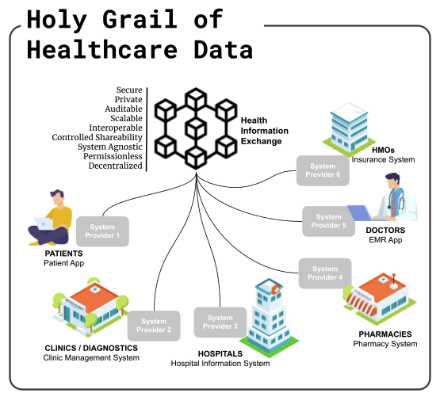
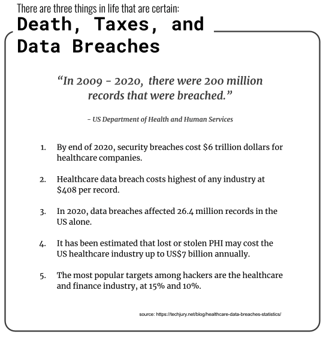
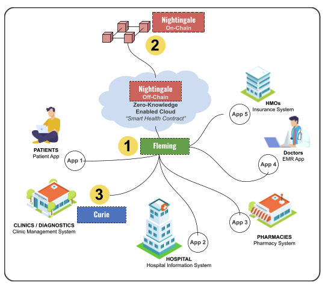

# Whitepaper

Decentralized Healthcare Infrastructure and Protocol for Web 3.0

David, D.; Emnace, I.; Tubig, J.

[www.hippocrades.com](https://hippocrades.org)

## What Hippocrades is solving?

**Abstract**. With different providers and diverse markets, healthcare solutions have become increasingly fragmented. Thus, a truly _decentralized_, _secure_, and _permissionless_ Healthcare Infrastructure continues to be a holy grail in the healthcare ecosystem. The pursuit of data privacy and security, which are of utmost importance, is also what makes it very difficult and challenging to make data more interoperable and shareable across different providers.

Over the last few years, there were experimental attempts to address this concern using blockchain technology. However, blockchain, despite showing potential, still falls short given its limitation on scalability, privacy, and auditability. If every healthcare transaction is placed in the chain, for example, this will be resource-intensive. Furthermore, blockchain’s ‘transparent, anyone can see’ setup becomes a liability to some degree as data privacy can never be compromised at any rate. Simply put, blockchain needs an additional element to optimize its power.

We propose Hippocrades — a solution that intends to finally resolve this dilemma. First, by adding a zero-knowledge proof cryptographic protocol on top of blockchain: addressing security, privacy, and scalability. Second, by providing healthcare applications and tech infrastructure designed for Web 3.0: any health system providers can easily utilize to create or augment their existing solutions making them secure, compliant, interoperable, and integrable in the blockchain. Third, by setting it up as a Decentralized Autonomous Organization (DAO): governed by set rules in a smart contract that is transparent and controlled by the organization members.

Hippocrades is beyond just a concept. Its three (3) technologies are already existing and will be presented in this paper.

## There are three things in life that are certain

## 2. Challenges in Building a Decentralized Healthcare Infrastructure

There are many players across the healthcare sector with increasing and differing pain points. Each uses their own solutions provided by different system providers using varying tech stacks. Naturally, interoperability becomes a concern on top of data security and privacy, especially if data needs to flow from one silo to another.

The previous and ongoing attempts of blockchain tech startups generally focus on addressing certain issues separately. Using blockchain definitely addresses those concerns, however this further adds up to creating more silos.

Below are the major challenges blocking the creation of a truly decentralized and secure healthcare infrastructure:

### Blockchain's Limitations

1. _**Scalability**_. Applications are provisioned for tiny execution environments with limited running time, minimal stack size, and restrictive instruction sets.
   1. Wasteful. Each miner must re-execute transaction
   2. Constrained. Limited running time, minimal stack size, & restrictive instruction sets
2. _**Privacy**_. Applications must reveal their state transition, enabling miner frontrunning attacks and consensus instability. The core strength is also its weakness. The history of all state transactions must be executed by all parties.
3. _**Auditability**_. Applications offer weak guarantees of correctness & safety.

### Health Applications and Solutions

1. _**Data Standardization and Scope**_. Some of the existing health solutions use old technologies, are not interoperable, and not compliant to industry standards. These add up to the difficulty in integrating with an HIE.
2. _**Availability of Front End Solutions**_. Some still do not have their own health solutions (EMR, LIS, RIS, Pharmacy, etc.) especially in emerging countries due to limitations on costs and technical challenges.
3. _**Availability of APIs for Easy Integration**_. Application Programming Interface (API) is an industry-standard that allows for an easy integration. The HIE should have a complete documentation of its APIs that integrators can use and reference with. This has not been reached.

### External Factors

1. _**Adoption and Incentives for Participation**_ . While the benefits can be great, there are a handful of challenges as mentioned above that disincentivize participation even when a government formulates a bill that requires health facilities to do so.
2. _**Regulatory Considerations**_. Blockchain has made good progress but may still be challenged by enactment of new laws that may limit its use.

### Truly Decentralized Setup

1. _**Governance**_. If it is run solely by a particular organization or government entity, then it is run in a centralized manner. Issues may arise on accountability, transparency of operations, management decisions among other things.

## 3. Hippocrades

**HIPPOCRADES** is short for Health Infrastructure and Private Protocol On Chain with Ready-to-use Applications in a Decentralized Environment and Setup.

Hippocrades is the Web 3.0 infrastructure and protocol for health information. Its primary purpose is to be a platform for interoperability and health data exchange among different information systems. To reach this desired but elusive goal however, it requires an infrastructure of (1) health applications and (2) a comprehensive set of secured APIs even before attempting to put together a blockchain protocol for it.

These are necessary solutions, without them, onboarding in the blockchain will have extreme challenges. Thus, a lot of blockchain tech startups are not able to reach their full potential as they primarily focus on building their blockchain apps with little consideration to addressing the other gaps.

### Two Facets

Hippocrades seeks to address two important facets of being a platform for health information:

1. _**Privacy**_. Because Hippocrades deals in health information, a top concern is privacy – to what extent must we allow a patient’s information to be revealed and shared among parties, in order to succeed in providing that patient with the healthcare they need?
2. _**Interoperability**_. The most significant barrier today to efficient health information is that health information is highly fragmented. Health information is either kept manually on paper or digitized in disparate information systems (in practice, even two health facilities beside each other are likely to have separate, wildly incompatible databases!).

Additionally, what connects Hippocrades to the real world is its goal of accessibility. Hippocrades seeks to provide a solution for the above problems of interoperability and privacy, while at the same time making it concretely applicable to clinics, hospitals, and health facilities in their day-to-day operations.

### Hippocrades Approach

Hippocrades provides three (3) major components to fill the gaps in building the decentralized healthcare infrastructure.

**Fleming**, **NightIngale**, and Curie comprise **Hippocrades**’ advanced solutions and comprehensive API services to address different healthcare needs making systems compliant and interoperable while protecting and securing sensitive personal health records.

While this may sound grandiose and far-fetched considering the amount of time needed for development work, the next section would show that a significant part of the Hippocrades setup is already existing and in place.

## 4. Hippocrades Solutions
