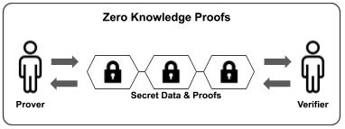

# Hippocrades Whitepaper

Decentralized Healthcare Infrastructure and Protocol for Web 3.0

David, D.; Emnace, I.; Tubig, J.

[www.hippocrades.com](https://hippocrades.org)

## What Hippocrades is solving?

**Abstract**. With different providers and diverse markets, healthcare solutions have become increasingly fragmented. Thus, a truly _decentralized_, _secure_, and _permissionless_ Healthcare Infrastructure continues to be a holy grail in the healthcare ecosystem. The pursuit of data privacy and security, which are of utmost importance, is also what makes it very difficult and challenging to make data more interoperable and shareable across different providers.

Over the last few years, there were experimental attempts to address this concern using blockchain technology. However, blockchain, despite showing potential, still falls short given its limitation on scalability, privacy, and auditability. If every healthcare transaction is placed in the chain, for example, this will be resource-intensive. Furthermore, blockchain’s ‘transparent, anyone can see’ setup becomes a liability to some degree as data privacy can never be compromised at any rate. Simply put, blockchain needs an additional element to optimize its power.

We propose Hippocrades — a solution that intends to finally resolve this dilemma. First, by adding a zero-knowledge proof cryptographic protocol on top of blockchain: addressing security, privacy, and scalability. Second, by providing healthcare applications and tech infrastructure designed for Web 3.0: any health system providers can easily utilize to create or augment their existing solutions making them secure, compliant, interoperable, and integrable in the blockchain. Third, by setting it up as a Decentralized Autonomous Organization (DAO): governed by set rules in a smart contract that is transparent and controlled by the organization members.

Hippocrades is beyond just a concept. Its three (3) technologies are already existing and will be presented in this paper.

## There are three things in life that are certain

## 1. Introduction

Many studies have shown the enormous benefits of having a Health Information Exchange (HIE) - from the improvement in the quality of care, better healthcare delivery, increased safety, elimination of duplicate testing, to the reduction of healthcare costs.

An HIE allows the exchange of healthcare information electronically from one organization to another among different information systems. The demand for this is growing along with nationwide efforts to improve the quality, safety, and efficiency of health care delivery. The supposedly efficient, timely, and safe access and retrieval of health data bring about the many advantages of having such a platform.

In the US, meaningful use requirements, new payment approaches that stress care coordination, and federal financial incentives drive the interest and demand for health information exchange.

For many countries, especially the emerging ones, implementing an HIE is still a far cry from reality. This is because of the many significant challenges in building one, such as standardizations, at-scale interoperability, data security, data privacy, data integrity, identity assurance, risk management, and auditability. Even for developed countries that have taken big steps toward this direction, there are still ongoing obstacles in achieving the intended setup.

Simply put, having a decentralized, secure and permissionless Health Information Exchange (HIE) platform has always been quite an impossible goal. Most, if not all, of the existing HIEs now, while functional, still have not fully addressed the security and trust concerns. On top of this, there are apprehensions of private data being managed on a centralized platform by a single organization.

### HIE in Blockchain

The advent of Blockchain technology has brought much potential to stamping out these challenges. In 2016, different whitepapers were submitted in the Healthcare Blockchain Challenge 3 by the US Department of Health and Human Services’ Office of the National Coordinator for Health Information Technology (ONC). The papers were from reputable organizations that provided sound concepts and ideas on the uses and benefits of blockchain and how it can be integrated in achieving a decentralized healthcare infrastructure.

It was emphasized that blockchain technology would change the model for engaging with and governing a Health Information Exchange giving patients more control over their healthcare information. 4 And since records are guaranteed to be cryptographically secure, there is no possibility of bad actors threatening data integrity. Fraud and abuse are reduced with blockchain-timestamped protocols and blockchain-enabled traceability and accountability allowing health providers to share networks without compromising data privacy, security, and integrity.

In addition, a blockchain-powered health information exchange could unlock the true value of interoperability. In this interoperable blockchain, smart contracts can be created to a Hub as the gateway to store standardized information, which can be immediately accessible to all organizations allowed by the blockchain. This can be accomplished by creating an application program interface (API) oriented architecture to feed the smart contract. The APIs will be published and made available to all participating organizations connected to the blockchain – enabling frictionless integration with each organization’s existing systems.

Capitalizing on this technology has the potential to connect fragmented systems to generate insights and to better assess the value of care. In the long term, a nationwide blockchain network may improve efficiencies and support better health outcomes for patients.

Indeed, there is no lack of literature pointing out the numerous opportunities of blockchain in healthcare. Concepts including frameworks have been provided on how it can be set up.

Today, while there have been attempts to implement these ideas, an effective, decentralized, secure, trustless HIE platform and healthcare infrastructure have yet to emerge. This is primarily because of the limitations that decentralized ledgers supporting rich applications create: scalability, privacy, and auditability.

Fortunately, a cryptography method that has found its way to blockchain, called _Zero-Knowledge (ZK) Proof_, a protocol, where prover (A) can prove that A knows information X to a verifier (B) without sharing any other knowledge to B other than that A knows X.

Popularized and deployed by the likes of Zcash, this indeed may be the missing piece to address these concerns and finally fully optimize blockchain’s potential.

### Health Infrastructure

As an important aside, designing and building this decentralized HIE is only a part of the pie, albeit a big one at that. It necessitates looking at the macro view of the ecosystem’s healthcare infrastructure in general. This is to discover if there are other gaps in the processes that need to be addressed. The sector is a deluge of different markets with varying needs resulting in numerous providers creating independent solutions to these differing requirements.

First, the availability and effectiveness of Health Information Systems and solutions (such as Electronic Health Records or EHR) used by the health facilities are in various stages. Many are still using old technologies that are neither interoperable nor compliant with today’s standards. Some health facilities do not even have their own EHR applications while some use systems that lack important modules and functionalities. Second, all these health information systems, as they integrate with the HIE, should comply with standards so as not to compromise security, privacy, and auditability. Currently, not all industry-set standards are met.

Furthermore, the main point of having an HIE is to centralize the exchange of transactions, but aggregating all these under one platform and organization does not lead to a decentralized approach. Why? Because of the hesitation and resistance of giving this responsibility to one single entity. There are trust issues with providers, transparency and integrity of the application, and the potential vulnerability to attacks.

### Hippocrades in a Nutshell

To resolve the above-mentioned concerns, Hippocrades will be utilizing these two amazing technologies - the blockchain and zero-knowledge. The combination of this powerful duo and integrating them into Hippocrades’ existing health-tech platform could ultimately address the dilemma the healthcare industry has long been wanting to solve.

Hippocrades’ tech which has been in constant development and improvements since 2016, includes comprehensive front-end solutions like Electronic Health Records or EHR systems (_**CURIE**_, status: done), Healthcare API endpoints (_**FLEMING**_, status: done), and its HIE Blockchain (_**NIGHTINGALE**_, status: POC done) which acts as a ‘smart contract’ for health data exchanges.

As a logical extension, Hippocrades will implement the DAO (Decentralized Autonomous Organization) model so that the dream of having a truly decentralized, secure, and trusted healthcare infrastructure will finally come to fruition.

## 2. Challenges in Building a Decentralized Healthcare Infrastructure

There are many players across the healthcare sector with increasing and differing pain points. Each uses their own solutions provided by different system providers using varying tech stacks. Naturally, interoperability becomes a concern on top of data security and privacy, especially if data needs to flow from one silo to another.

The previous and ongoing attempts of blockchain tech startups generally focus on addressing certain issues separately. Using blockchain definitely addresses those concerns, however this further adds up to creating more silos.

Below are the major challenges blocking the creation of a truly decentralized and secure healthcare infrastructure:

### Blockchain's Limitations

1. _**Scalability**_. Applications are provisioned for tiny execution environments with limited running time, minimal stack size, and restrictive instruction sets.
   1. Wasteful. Each miner must re-execute transaction
   2. Constrained. Limited running time, minimal stack size, & restrictive instruction sets
2. _**Privacy**_. Applications must reveal their state transition, enabling miner frontrunning attacks and consensus instability. The core strength is also its weakness. The history of all state transactions must be executed by all parties.
3. _**Auditability**_. Applications offer weak guarantees of correctness & safety.

### Health Applications and Solutions

1. _**Data Standardization and Scope**_. Some of the existing health solutions use old technologies, are not interoperable, and not compliant to industry standards. These add up to the difficulty in integrating with an HIE.
2. _**Availability of Front End Solutions**_. Some still do not have their own health solutions (EMR, LIS, RIS, Pharmacy, etc.) especially in emerging countries due to limitations on costs and technical challenges.
3. _**Availability of APIs for Easy Integration**_. Application Programming Interface (API) is an industry-standard that allows for an easy integration. The HIE should have a complete documentation of its APIs that integrators can use and reference with. This has not been reached.

### External Factors

1. _**Adoption and Incentives for Participation**_ . While the benefits can be great, there are a handful of challenges as mentioned above that disincentivize participation even when a government formulates a bill that requires health facilities to do so.
2. _**Regulatory Considerations**_. Blockchain has made good progress but may still be challenged by enactment of new laws that may limit its use.

### Truly Decentralized Setup

1. _**Governance**_. If it is run solely by a particular organization or government entity, then it is run in a centralized manner. Issues may arise on accountability, transparency of operations, management decisions among other things.

## 3. Hippocrades

**HIPPOCRADES** is short for Health Infrastructure and Private Protocol On Chain with Ready-to-use Applications in a Decentralized Environment and Setup.

Hippocrades is the Web 3.0 infrastructure and protocol for health information. Its primary purpose is to be a platform for interoperability and health data exchange among different information systems. To reach this desired but elusive goal however, it requires an infrastructure of (1) health applications and (2) a comprehensive set of secured APIs even before attempting to put together a blockchain protocol for it.

These are necessary solutions, without them, onboarding in the blockchain will have extreme challenges. Thus, a lot of blockchain tech startups are not able to reach their full potential as they primarily focus on building their blockchain apps with little consideration to addressing the other gaps.

### Two Facets

Hippocrades seeks to address two important facets of being a platform for health information:

1. _**Privacy**_. Because Hippocrades deals in health information, a top concern is privacy – to what extent must we allow a patient’s information to be revealed and shared among parties, in order to succeed in providing that patient with the healthcare they need?
2. _**Interoperability**_. The most significant barrier today to efficient health information is that health information is highly fragmented. Health information is either kept manually on paper or digitized in disparate information systems (in practice, even two health facilities beside each other are likely to have separate, wildly incompatible databases!).

Additionally, what connects Hippocrades to the real world is its goal of accessibility. Hippocrades seeks to provide a solution for the above problems of interoperability and privacy, while at the same time making it concretely applicable to clinics, hospitals, and health facilities in their day-to-day operations.

### Hippocrades Approach

Hippocrades provides three (3) major components to fill the gaps in building the decentralized healthcare infrastructure.

**Fleming**, **NightIngale**, and Curie comprise **Hippocrades**’ advanced solutions and comprehensive API services to address different healthcare needs making systems compliant and interoperable while protecting and securing sensitive personal health records.

While this may sound grandiose and far-fetched considering the amount of time needed for development work, the next section would show that a significant part of the Hippocrades setup is already existing and in place.

## 4. Hippocrades Solutions
