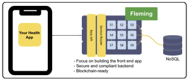

# ✋ Use Cases

## Health Information Exchange 

A truly decentralized and secure HIE remains elusive, even for advanced countries. But putting blockchain technology + zk proof with Hippocrades could ultimately be the holy grail the healthcare industry has long been wanting to achieve. See section on HIE.

.png>)

Note: One good use case for this is that there are several ‘vaccine passport’ system providers or health government units but use one central exchange for validation. It would be a mess if each one would create its own validation. Even riskier if one big tech company would monopolize handling of such data.

## Health Apps Development 

#### [Try Demo App](https://emr.hippocrades.com) 

If one is building a health app, there is a high chance it would need a module for storing user health records. Instead of doing this component from scratch, it can utilize Hippocrades' comprehensive API services. This way the focus is on building the intended app itself without worrying about compliance as this is already built-in in the infrastructure.

There are many possible ways on custom building apps with the extensive APIs available. The API docs can be seen at www.hapihub.com/api.

Note: API is short for Application Programming Interface, which acts as a ‘bridge’ to easily integrate another system.

## Ready-to-Use Solutions 

Up to now, many health facilities still have zero medical records systems. Some use basic spreadsheets to record data. A few still use old legacy systems. It is not only capital intensive to implement a new system but the upkeep on compliance and upgrades can also be cost-prohibitive and expensive.

Curie already has available solutions like EHR, LIS, RIS, and other health modules (see list in Curie section). They can also be integrated with Web 3.0.

## Privacy & Security Compliance 

Around the globe, there are thousands of health facilities (clinics, health centers, hospitals) using Electronic Health Records (EHR) systems that are still NOT compliant with data privacy laws. Therefore, there are higher risks for potential exposure of health records.

Without changing their existing solutions, they can utilize HAPI Hub’s services to upgrade their platform.

.png>)

## Web 3.0 

Integrating with HAPI DAO’s blockchain is easy. It has documented APIs that devs can utilize to make their apps Web 3.0 ready.

.png>)
