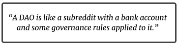
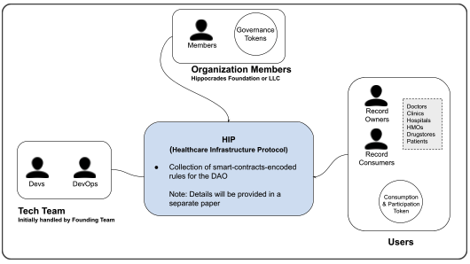

# Decentralized Autonomous Organization

## Complete Decentralized Setup

To have a truly decentralized setup, Hippocrades will apply the Decentralized Autonomous Organization (DAO) model.

### What is a DAO?

A Decentralized Autonomous Organization (DAO) is an organization governed by rules encoded as a computer program that is transparent and controlled by the organization members and not influenced by a central government.

Through smart contracts, a DAO can work with external information and execute commands based on them – all this without any human intervention. A DAO makes the decentralized ownership of an organization possible.

Members of a DAO are not tied by any formal contract. They are instead bound together by a common goal and network incentives tied to the consensus rules. Once a DAO is deployed, it cannot be controlled by a single party but is governed by a community of participants. The DAO framework can be considered the last piece of a puzzle that pushes the entire blockchain ecosystem to become fully autonomous and decentralized.

Integrating the DAO model plus the Zero Knowledge Proof protocol in Hippocrades will ultimately bring the platform to the ideal setup that was originally intended for a truly decentralized, secured and trustless Health Information Exchange (HIE).

## Health Infrastructure Protocol

**Protocol**: Where the smart contracts will be set. Details of this will be written on a separate paper, including the defined roles, benefits, incentives, etc. of the different players.

**Organization Members**: The members will control Hippocrades’ direction. The majority would ideally be coming from the healthcare ecosystem.

**Users**: There would be exchanges between record owners and record consumers. Generally, they would be doctors, clinics, hospitals, HMOs, drugstores, and patients.

**Tech Team**: The tech platform will be maintained by this group as directed from policies set by the members. Initially, this will be handled by the founding team until proper turnover.

\*Initially, Hippocrades core team will set up and set the direction until proper turnover to the DAO. Activities and timeline will be provided accordingly.

