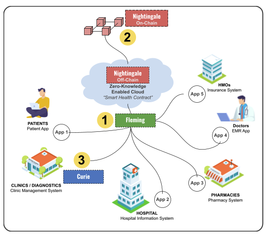

# 2⃣ Challenges

There are many players across the healthcare sector with increasing and differing pain points. Each uses their own solutions provided by different system providers using varying tech stacks. Naturally, interoperability becomes a concern on top of data security and privacy, especially if data needs to flow from one silo to another.

The previous and ongoing attempts of blockchain tech startups generally focus on addressing certain issues separately. Using blockchain definitely addresses those concerns, however this further adds up to creating more silos.

Below are the major challenges blocking the creation of a truly decentralized and secure healthcare infrastructure:

### Blockchain's Limitations

1. _**Scalability**_. Applications are provisioned for tiny execution environments with limited running time, minimal stack size, and restrictive instruction sets.
   1. Wasteful. Each miner must re-execute transaction
   2. Constrained. Limited running time, minimal stack size, & restrictive instruction sets
2. _**Privacy**_. Applications must reveal their state transition, enabling miner frontrunning attacks and consensus instability. The core strength is also its weakness. The history of all state transactions must be executed by all parties.
3. _**Auditability**_. Applications offer weak guarantees of correctness & safety.

### Health Applications and Solutions

1. _**Data Standardization and Scope**_. Some of the existing health solutions use old technologies, are not interoperable, and not compliant to industry standards. These add up to the difficulty in integrating with an HIE.
2. _**Availability of Front End Solutions**_. Some still do not have their own health solutions (EMR, LIS, RIS, Pharmacy, etc.) especially in emerging countries due to limitations on costs and technical challenges.
3. _**Availability of APIs for Easy Integration**_. Application Programming Interface (API) is an industry-standard that allows for an easy integration. The HIE should have a complete documentation of its APIs that integrators can use and reference with. This has not been reached.

### External Factors

1. _**Adoption and Incentives for Participation**_ . While the benefits can be great, there are a handful of challenges as mentioned above that disincentivize participation even when a government formulates a bill that requires health facilities to do so.
2. _**Regulatory Considerations**_. Blockchain has made good progress but may still be challenged by enactment of new laws that may limit its use.

### Truly Decentralized Setup

1. _**Governance**_. If it is run solely by a particular organization or government entity, then it is run in a centralized manner. Issues may arise on accountability, transparency of operations, management decisions among other things.
