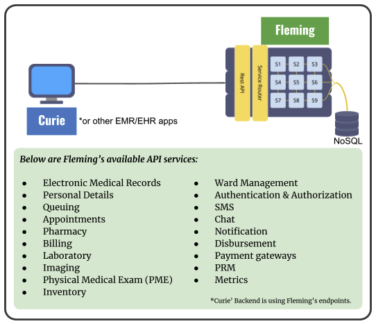
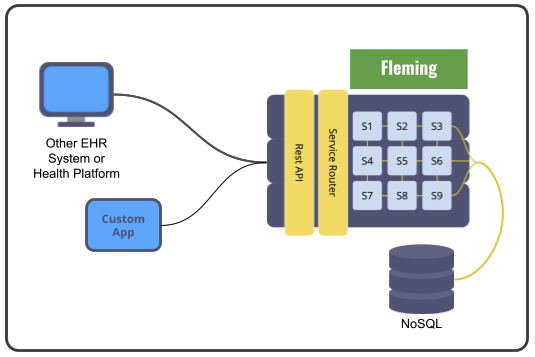
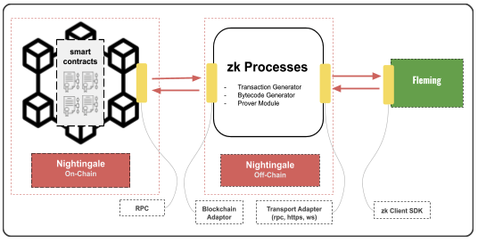

# Hippocrades Solutions

## <mark style="color:green;">FLEMING</mark>

Hippocrades is exposed as a set of comprehensive healthcare APIs covering crucial medical information such as patients, medical records, diagnostic test results, and so on. These APIs collectively form Fleming.

Fleming APIs have been developed to form the backbone of health-tech products for doctors, clinics, hospitals, pharmacies, and other health facilities, capturing important business logic cross-connecting all these different sources of medical information with each other.

These APIs are exposed as well-documented REST endpoints, promoting interoperability with any modern information system. Even legacy information systems may connect to Fleming and begin storing on the Health Information Exchange by developing a thin REST client layer on top of their existing architecture, driving the potential for market acceptance even higher.

Below are the security/privacy/compliance features:

* 2FA Authentication
* Encryption by default, at rest and in-transit
* Industry-standard encryption algorithms (AES256)
* Data hashing for integrity checks
* Disassociated records
* Audit logs
* Privileged access management
* Adheres to HIPAA guidelines

Fleming is system agnostic, allowing any system to easily integrate with it. In doing so, an existing EHR system can utilize Fleming’s API endpoints to avail of its different services, as mentioned above. As such, EHR System or Health Platform Providers can also add modules and functionalities using Curie’s front-end solutions or create their Custom App from scratch using the services provided by the APIs.

Ownership and privilege-based access are first-class concerns in Fleming’s architecture in its effort to maintain privacy even while promoting interoperability. In fact, the system is even architected to dissociate personally identifiable information (PII) from protected health information (PHI) via encryption.

Even with these safeguards, however, there are still cases where different parties must verify health information, and traditionally there would be no other way to accomplish this than to share the health information in question. Privacy concerns in these cases are mitigated by strict privacy compliance legislation, but it doesn’t change the fact that there are different eyes on the health information in question. Not to mention that privacy compliance in this way is based on trust – that the third parties are not secretly taking advantage of access to patients’ health information.

This is where Nightingale blockchain comes in, using the novel concept of zero-knowledge proofs to accomplish completely private information exchange.

Status: DONE

Fleming is already existing and functional. Curie’s backend is primarily using Fleming. One can check the available APIs at [www.hapihub.com/api](https://hapihub.com/api).

## <mark style="color:red;">NIGHTINGALE</mark>

Nightingale architecture is designed to be the decentralized, secured, and trusted Health Information Exchange (HIE) platform. It acts as the ‘smart health contract’ where pre-specified rules are set.

It utilizes the zk-SNARKs in a Zero-Knowledge Proof enabled cloud. This is one part of the Nightingale that runs outside of the blockchain. Typically, smart contracts are also stored ‘on chain’ thus concerns on privacy, storage, and run-time constraints arise. Having this setup eliminates mentioned issues while maintaining the integrity and validation the blockchain provides.

Since this is outside the blockchain, the setup allows the chain to be scalable without compromising security and privacy. It remains auditable as transactions, recorded as ‘zk proofs’, are submitted and timestamped in the blockchain.

### Zero-Knowledge Proof

Zero-knowledge (zk) techniques are mathematical methods used to verify things without sharing or revealing underlying data. Zero-knowledge protocols are probabilistic assessments, which means they don't prove something with complete certainty. Instead, they provide small pieces of unlinkable information that can accumulate to show that the validity of an assertion is overwhelmingly probable.

### zk-SNARKs

zk-SNARK stands for “Zero-Knowledge Succinct Non-Interactive Argument of Knowledge,” and refers to a proof construction where one can prove possession of certain information, e.g. a secret key, without revealing that information, and without any interaction between the prover and verifier.

### ZEXE Protocol

Zexe is a new blockchain design that enables both data privacy and function privacy in addition to succinctness. In other words, not only can transactions be generated offline and efficiently verified on-chain, the time needed to verify the transaction is independent of the time required to do the offline computation to which the prover attests to. It achieves this by introducing a new cryptographic primitive called a Decentralized Private Computation (DPC).

|                                                                    | Decentralized                       | Private                              | Programmable                         |
| ------------------------------------------------------------------ | ----------------------------------- | ------------------------------------ | ------------------------------------ |
| Bitcoin                                                            | <mark style="color:green;">✔</mark> | <mark style="color:orange;">✘</mark> | <mark style="color:orange;">✘</mark> |
| Ethereum                                                           | <mark style="color:green;">✔</mark> | <mark style="color:orange;">✘</mark> | <mark style="color:green;">✔</mark>  |
| Zcash                                                              | <mark style="color:green;">✔</mark> | <mark style="color:green;">✔</mark>  | <mark style="color:orange;">✘</mark> |
| Hippocrades <mark style="color:red;">\*</mark>via zk-enabled cloud | <mark style="color:green;">✔</mark> | <mark style="color:green;">✔</mark>  | <mark style="color:green;">✔</mark>  |

<mark style="color:red;">\*</mark>ZEXE is a protocol for decentralized private computation

Hippocrades will have two (2) parts, the off-chain, and the on-chain. In doing so, the three components - Decentralization, Privacy, and Programmability are attainable in the setup.

### Off-Chain

Fleming information intended for verifying (which was previously accomplished by sharing said information!) will be processed into a zero-knowledge proof (specifically, a zk-SNARK). This is done in a separate RPC-controlled server with access to cryptographic primitives and libraries required to produce the zero-knowledge proof.

Verifiers can use this zero-knowledge proof publicly to affirm truths about the information without requiring the data itself to be shared with them.

For example, a pharmacist may verify that a patient indeed has a prescription for a certain medicine without ever receiving a copy of the prescription. An insurance company may verify that a patient indeed received treatment for a certain diagnosis without ever receiving a copy of either the diagnosis or the invoice for the treatment procedures.

The ZK server then sends this zero-knowledge proof via RPC to the on-chain component of Nightingale.

### On Chain

Zero-knowledge proofs from the off-chain component of Nightingale are received via RPC and encoded into a transaction on the blockchain. This step confers blockchain’s advantages of integrity, immutability, decentralization, and resilience to forgery to all zero-knowledge proofs generated for Fleming information.

Nightingale’s blockchain is flexible in its requirements, only requiring Turingcomplete smart contracts to be supported (of which there are numerous available on the market today, such as Ethereum or Cardano). To prepare any blockchain for connection to Nightingale, there are two components:

1. A thin RPC-ready layer to expose blockchain operations via RPC (such as creating transactions and finding their blocks on the chain)
2. A set of general smart contracts to cover Nightingale’s use cases and domain

Because of the clear separation of concerns between the off-chain and on-chain components (communicating only via RPC), Nightingale may be deployed onto any chain (and even several chains!) by developing only the above two (2) components, instead of re-outfitting the entire architecture from scratch.

Status: Proof of Concept (POC), DONE

Request Access at [Hippocrades Community](https://github.com/hippocrades/hippocrades-community)

### <mark style="color:blue;">CURIE</mark>

While Fleming and Nightingale together already comprise a health information platform model on their own, Hippocrades also seeks to make this solution accessible not just to the information technology industry at large, but all the way down to the grassroots level: actual players in the healthcare industry (doctors, patients, clinics, health facilities).

As such, the entry point to Hippocrades does not stop at RPC endpoints and APIs. A complete health facility information system has also been built using Fleming as a backend. This information system, implemented as a set of web applications, is collectively known as Curie.

Curie uses modular design in order to expose its complete set of modules and features (e.g. Registration and Queueing, Electronic Medical Records, Billing, Inventory, Laboratory and Radiology, Ward Management) into products fit for different health facilities:

* An electronic medical records system for individual doctors
* A clinic management system for outpatient clinics
* A laboratory information system and/or a radiology information system for diagnostic centers
* A hospital management system for hospitals
* A pharmacy management system for drugstores and pharmacies

Curie makes it possible for health facilities to digitize their operations, all while automatically connecting to Hippocrades and enjoying the benefits of interoperability and privacy.

Any health facility or care provider can easily sign up for an account and even create its own self-managed MongoDB database in Google Cloud, AWS, or Azure. With Curie, a user can easily enable the system to participate and be integrated with the Nightingale blockchain network via the Fleming interface (see diagram). In doing so, the health facility ensures compliance with regulatory requirements.
